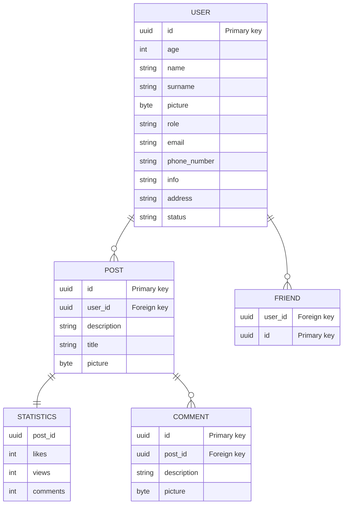

```mermaid
erDiagram
    USER {
        uuid id "Primary key"
        int age
        string name 
        string surname
        byte picture
        string role
        string email
        string phone_number
        string info
        string address
        string status
        
    }

    POST {
        uuid id "Primary key"
        uuid user_id "Foreign key"
        string description
        string title
        byte picture
    }

    COMMENT {
        uuid id "Primary key"
        uuid post_id "Foreign key"
        string description
        byte picture
    }

    FRIEND {
        uuid user_id "Foreign key"
        uuid id "Primary key"
    }

    STATISTICS {
        uuid post_id
        int likes
        int views
        int comments
    }

    
USER ||--o{ POST : ""
POST ||--|| STATISTICS : ""
POST ||--o{ COMMENT : ""
USER ||--o{ FRIEND : ""

```